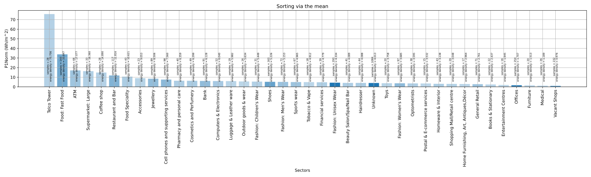

# Harnessing Big Data and High Performance Compute to Understand Commercial Energy Usage and Utility Generation Dynamics

The focus of this Independent Study Project (ISP) revolves around analyzing electricity power consumption. The primary objective is to examine consumption patterns among commercial and retail users. This project is motivated by the observation that many consumers pay their electricity bills without considering the trends and insights embedded within their usage data.

By analyzing these patterns, the project aims to empower consumers to make more informed decisions about their energy usage, contributing to efforts against climate change. Uncovering nuanced patterns within electricity data is expected to offer valuable insights, ultimately helping society become more energy-efficient. The passion for power generation and consumption stems from its pervasive impact on modern economies and daily life, where reliable electricity is a fundamental necessity.

## Files in This Project

<pre>
Files in this project
|->README.md [This file]
|->Energy_data_exploration.ipynb [A Jupyter notebook file that delves into the dataset, doing basic analyses and exploration]
|->Energy_data_processing.ipynb [A Jupyter notebook file that reads and computes the dataset with dask dataframes. Statistical data and images is generated and exported]
|->power_consumption_data.7z [A small sample of the dataset, full dataset does not fit in github]
|->Siku_script.sh [The script used to execute the python code contained in Energy_data_processing.ipynb]
|->.gitattributes [Required for Gitgub Large File System used by Energy_data_processing.ipynb]
|->ISP Presentation.pdf [Presentation slides]
|->ISP report.pdf[Project report]
|-data->bp-*.csv [Statistical data generated for a benchmark base plot]
|     ->hg-*.csv [Statistical data generated for a benchmark histogram plot]
|-images-> pt-mn-*-tm.svg [Benchmark plot with mean statistical data with a random comparison meter]
        -> pt-md-*-tm.svg [Benchmark plot with median statistical data with a random comparison meter]
        -> hg-*-tm.svg [Benchmark plot with histogram statistical data with a random comparison meter]
        -> sv-*.svg [Sorted Energy density benchmark graph of different market sectors via mean, max and 25th, 50th, 75th percentile]
</pre>

## `Energy_data_exploration.ipynb`
This notebook performs initial exploratory and data analysis on a smaller subset of the dataset. It provides an overview of key dataset attributes, including the number of samples, columns, shapes, data types, and basic calculations.

### Analyses and Exploration

- Extracting unique values from Costcentre and MarketSector identifier columns
- Counting distinct AccountID entries for each market sector
- Retrieving and displaying unique attributes for MeterPoint
- Showing distinct Account IDs
- Aggregating and combining data based on unique Account IDs
- Filtering and analyzing data for specific accounts
- Reviewing meter point details for selected accounts
- Filtering and displaying data for specific meter IDs
- Narrowing data by specified time periods
- Visualizing data associated with meter IDs
- Plotting data related to grid supply meters

## `Energy_data_processing.ipynb`

This Jupyter notebook focuses on processing CSV files containing power data. It is the primary module for analyzing and visualizing the provided data.

### Feature Engineering

- Data aggregation and filtering
- Plotting histograms and distributions
- Creating time-series benchmark plots
- Exporting statistical data:
  - **Features**
    - Histogram with skewed normal distribution
    - Time-Series benchmark plot
    - Energy density benchmark graph for different market sectors

### Sample Images

*Histogram with skewed normal distribution and comparison*

*Mean with standard deviation time-series benchmark plot and comparison*

*Median and significant percentile range of time-series benchmark plot and comparison*

*Energy density of market sectors in descending order*
